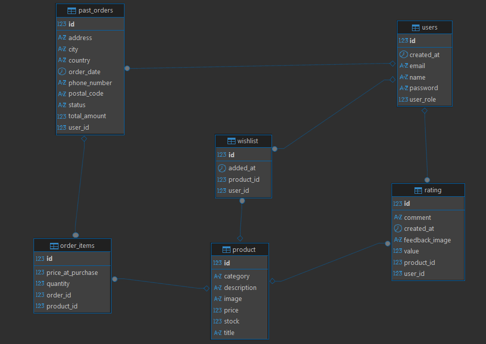

<div align="center">

# E-Commerce Monolith API

Spring Boot monolith for an e-commerce platform — catalog, orders, ratings, wishlists, admin operations, and asynchronous email/image processing behind a stateless JWT API.


</div>

---

## Table of Contents

- [Overview](#overview)
- [Architecture](#architecture)
- [Tech Stack](#tech-stack)
- [API Surface](#api-surface)
- [Data Model](#data-model)
- [Authentication](#authentication)
- [Getting Started](#getting-started)
- [Testing](#testing)
- [Load Testing (JMeter)](#load-testing-jmeter)
- [CI/CD & Deployment](#cicd--deployment)
- [Roadmap](#roadmap)
- [Author](#author)

---

## Overview

Single-deployable Spring Boot service for an online store ("Meezan Store", per the branding in the order-receipt template): registration and JWT login, a searchable/filterable product catalog, ratings and reviews with photo uploads, wishlists, checkout with atomic stock control, and an admin surface for catalog and order management.

Reads that are expensive or hit repeatedly are cached in Redis. Anything slower than the database — SMTP, S3 — is pushed through RabbitMQ instead of blocking the request thread. The API has been load-tested with JMeter up to 8,000 concurrent users, with results committed to the repo (see [Load Testing](#load-testing-jmeter)).

**Capabilities**

- JWT auth, `USER` / `ADMIN` roles, method-level authorization on admin routes
- Paginated, searchable, sortable catalog with per-category browsing
- Ratings & reviews — one per user/product, optional photo, cached average
- Wishlist toggle/list
- Checkout with atomic stock decrement, 5% tax, per-user order history
- Admin: order/product management, order status transitions, CSV bulk import
- Async order-receipt and status emails (Thymeleaf + RabbitMQ)
- Async image pipeline: S3 upload with downscaling, deletion, presigned delivery
- Redis caching with explicit invalidation on writes
- Default admin account seeded on startup

## Architecture

Layered monolith, one deployable JAR: `Controller → Service → Repository → Entity`.

```
Client
  │
  ▼
JwtAuthFilter                validates Bearer token, populates SecurityContext
  │                          (no-op if absent/invalid — request still proceeds)
  ▼
Security filter chain        route rules + @PreAuthorize
  │
  ▼
Controllers                  /users  /product  /orders  /admin
  │
  ▼
Services   ─────────────────▶ Redis         (cache reads, evict on writes)
  │        ─────────────────▶ RabbitMQ      (async email + image jobs)
  ▼
Spring Data JPA / Hibernate ─▶ PostgreSQL

Queue consumers:
  EmailService  → Gmail SMTP
  S3Service     → AWS S3 (resize / upload / delete / presign)
```

**Design decisions**

- **Stateless sessions** — `SessionCreationPolicy.STATELESS`; identity travels entirely in the JWT, nothing server-side to invalidate.
- **Cache-aside on hot reads** — ratings, feedback, category listings, order history, and admin lookups are `@Cacheable`, with matching `@CacheEvict`/`@Caching` on the writes that invalidate them.
- **Side effects off the request path** — SMTP and S3 calls are published to RabbitMQ and handled by separate listeners, so a purchase or review submission doesn't wait on email or image I/O.
- **Atomic inventory control** — stock is decremented with a single conditional `UPDATE ... WHERE stock >= :qty`, preventing overselling under concurrent checkout without a pessimistic lock.
- **Price snapshotting** — `OrderItems.priceAtPurchase` is captured at checkout time, independent of later catalog price changes.

## Tech Stack

| Layer | Technology |
|---|---|
| Language | Java 21 |
| Framework | Spring Boot 4.1.0 (Web MVC, Security, Data JPA, Data Redis, AMQP, Mail, Thymeleaf) |
| Build | Maven (wrapper included — `mvnw` / `mvnw.cmd`) |
| Database | PostgreSQL (H2, PostgreSQL-compatibility mode, for the `test` profile) |
| Caching | Redis, via Spring's Cache abstraction |
| Messaging | RabbitMQ, via Spring AMQP |
| Auth | JJWT 0.12.6, Spring Security, BCrypt |
| Object storage | AWS S3 (AWS SDK for Java v2), presigned URLs |
| Email | Spring Mail (Gmail SMTP) + Thymeleaf templates |
| Bulk import | OpenCSV |
| Testing | JUnit 5, Mockito, Spring Boot Test |
| Load testing | Apache JMeter |
| Containerization | Docker (multi-stage build), Docker Compose |
| CI/CD | GitHub Actions → Amazon ECR → EC2 (`docker compose`) |
| Linting | Hadolint (Dockerfile) |

## API Surface

Base URL: `http://localhost:8080` (or your deployed host). Bodies are JSON unless noted.

### `/users`

| Method | Endpoint | Description | Access |
|---|---|---|---|
| POST | `/users/auth/register` | Register a customer; returns JWT + user summary | Public |
| POST | `/users/auth/login` | Log in a customer; returns JWT + user summary | Public |
| POST | `/users/mark/wishlist/{productId}` | Toggle a product in/out of the caller's wishlist | Authenticated |
| GET | `/users/watch/wishlist` | List the caller's wishlist | Authenticated |
| POST | `/users/rate` (multipart) | Submit a rating/review, optional photo | Authenticated |
| PUT | `/users/complete/rating/{ratingId}` (multipart) | Edit a rating/review, optional photo | Authenticated |
| DELETE | `/users/remove/{ratingId}` | Delete a rating/review | Authenticated |
| POST | `/users/sendMail` | Submit a support/contact message | Public |

### `/product`

| Method | Endpoint | Description | Access |
|---|---|---|---|
| GET | `/product/all?page=&size=&search=&category=&sort=` | Paginated, searchable, filterable, sortable catalog | Public |
| GET | `/product/{productId}` | Product detail | Public |
| GET | `/product/category/{category}` | Products by category | Public |
| GET | `/product/fetch/rating/{productId}` | Average rating | Public |
| GET | `/product/ratings/{productId}` | Feedback list | Public |

### `/orders`

| Method | Endpoint | Description | Access |
|---|---|---|---|
| GET | `/orders/history` | Caller's past orders | Authenticated |
| GET | `/orders/history/bought/{HistoryNo}` | Line items of one past order | Authenticated |
| POST | `/orders/purchase` | Checkout — creates an order from a cart payload | Authenticated |

### `/admin`

| Method | Endpoint | Description | Access |
|---|---|---|---|
| GET | `/admin/all` | List all users | ADMIN |
| POST | `/admin/auth/login` | Admin login; role validated in the service layer | Public route |
| POST | `/admin/products/bulk` (multipart CSV) | Bulk-import products; duplicate titles skipped | ADMIN |
| GET | `/admin/orders/all?page=&size=` | Paginated list of all orders | ADMIN |
| PUT | `/admin/orders/status/{orderId}` | Update order status; triggers a status email | ADMIN |
| GET | `/admin/users/count` | Total registered user count | ADMIN |
| POST | `/admin/product/create` (multipart) | Create a product, optional image | ADMIN |
| PUT | `/admin/product/edit/{productId}` (multipart) | Update a product, optional image | ADMIN |
| DELETE | `/admin/product/del/{productId}` | Delete a product | ADMIN |

## Data Model

PostgreSQL via Hibernate/Spring Data JPA (`ddl-auto=update` in the base profile):

- **`User`** (`users`) — id, name, email (unique), password (BCrypt, write-only in JSON), created_at, role (`USER`/`ADMIN`); owns ratings, wishlist items, past orders.
- **`Product`** — id, title (unique), description, category (enum), image (S3 key), stock, price; owns wishlist entries, ratings, order items.
- **`rating`** — id, value (1–5), comment, createdAt, feedbackImage; one row per (user, product), enforced by a unique constraint.
- **`wishlist`** — id, user, product, addedAt; join entity between users and products.
- **`PastOrders`** (`past_orders`) — id, user, orderDate, totalAmount, shipping fields (phone, address, city, country, postal code), status (`PENDING`/`SHIPPED`/`DELIVERED`/`CANCELLED`); owns order items.
- **`OrderItems`** — id, pastOrder, product, quantity, priceAtPurchase.



## Authentication

1. Register or log in against `/users/auth/*` (or `/admin/auth/login` for the admin role).
2. `JWTService` issues an HMAC-SHA-signed JWT (`jwt.secret`), subject = email, custom claims = `id` and `role`, 1-hour expiry.
3. The client sends `Authorization: Bearer <token>` on subsequent requests.
4. `JwtAuthFilter` validates signature/expiry and sets the user ID as the authentication principal and role as the authority — the principal is what scopes wishlists, ratings, and order history to the caller downstream.
5. `SecurityConfig`'s route rules and per-endpoint `@PreAuthorize("hasAuthority('ADMIN')")` gate access on the resolved role.
6. A default admin account is seeded on startup (`AdminSeeder`, a `CommandLineRunner`) from `ADMIN_EMAIL` / `ADMIN_PASSWORD`, if it doesn't already exist.

## Getting Started

**Prerequisites:** JDK 21 · PostgreSQL · Redis · RabbitMQ (`docker-compose.yml` provides one) · an AWS account with an S3 bucket · Gmail SMTP credentials (App Password).

### Environment variables

Required in every profile (resolved by `application.properties`):

| Variable | Used for |
|---|---|
| `MAIL_USERNAME` / `MAIL_PASSWORD` | Gmail SMTP credentials |
| `ADMIN_EMAIL` / `ADMIN_PASSWORD` | Seeded default admin account |

`S3Client`/`S3Presigner` are built without explicit credentials, so they resolve through the default AWS credential chain — export for local/manual runs:

| Variable | Used for |
|---|---|
| `AWS_ACCESS_KEY_ID` / `AWS_SECRET_ACCESS_KEY` | AWS credential chain (S3 access) |

Bucket name (`aws-ecom-meezan`) and region are hardcoded in `application.properties`, not env-driven.

Profile-specific (`SPRING_PROFILES_ACTIVE=local|prod|test`):

| Profile | Extra variables | Notes |
|---|---|---|
| `local` | *(none)* | Postgres/Redis/RabbitMQ hardcoded to localhost defaults |
| `prod` | `DB_PASSWORD`, `UPSTASH_REDIS_TOKEN` | RDS Postgres + Upstash Redis over TLS |
| `test` | *(none)* | H2 in-memory, PostgreSQL-compatibility mode; RabbitMQ autoconfig disabled |

Deployment-only (consumed by `docker-compose.yml` / GitHub Actions, not the app itself): `ECR_REGISTRY`, `ECR_REPOSITORY`, `AWS_REGION`, `EC2_HOST`, `EC2_USERNAME`, `EC2_SSH_KEY`.

Create a `.env` at the project root (already in `.gitignore`) for Compose to load into the container:

```env
SPRING_PROFILES_ACTIVE=prod
MAIL_USERNAME=your_gmail_address
MAIL_PASSWORD=your_gmail_app_password
ADMIN_EMAIL=admin@example.com
ADMIN_PASSWORD=change_me
DB_PASSWORD=your_rds_password
UPSTASH_REDIS_TOKEN=your_upstash_token
AWS_ACCESS_KEY_ID=your_aws_key
AWS_SECRET_ACCESS_KEY=your_aws_secret
```

For local, non-Docker runs, export the same variables in your shell or IDE run configuration — Spring reads them from the process environment either way.

### Run locally

```bash
git clone https://github.com/Alixoxox/E-Commerce-Monolith-Api.git
cd E-Commerce-Monolith-Api
```

1. Start PostgreSQL and create a database matching `application-local.properties` (`ECommerce`, user `postgres`), or edit that file to match your local setup.
2. Start Redis on `localhost:6379`.
3. Start RabbitMQ — your own instance, or just the `rabbitmq` Compose service (defaults to `admin`/`admin`, matching `application.properties`).
4. Export the environment variables above.
5. Run:

```bash
./mvnw spring-boot:run -Dspring-boot.run.profiles=local
```

API available at `http://localhost:8080`.

### Docker

`Dockerfile` is a multi-stage build: Maven/Temurin-21 compiles the JAR, then `eclipse-temurin:21-jre-jammy` runs it on port `8080`.

```bash
docker build -t ecom-backend .
docker run --env-file .env -p 8080:8080 ecom-backend
```

`docker-compose.yml` targets the **deployment host**, not local builds — `ecom-backend`'s image is `${ECR_REGISTRY}/${ECR_REPOSITORY}:latest`, i.e. it pulls the pre-built image from ECR rather than building the local `Dockerfile`. For local Compose use, either point that service at `build: .` instead, or run `docker compose up rabbitmq` for just the queue and run the backend separately.

```bash
docker compose up -d
```

## Testing

```bash
./mvnw test
```

Runs under the `test` profile (H2 in-memory, PostgreSQL-compatibility mode; RabbitMQ autoconfiguration excluded; `RabbitTemplate`/`ConnectionFactory` mocked where needed):

- `EComerceApplicationTests` — Spring context loads.
- `ProductServiceTest`, `UserServiceTest`, `WishServiceTest` — Mockito-based service-layer unit tests.

CI runs the same command on every push: `mvn clean test -Dspring.profiles.active=test`.

## Load Testing (JMeter)

Load-tested with Apache JMeter along two axes — sequential ramp-up and fully concurrent spike — from 1,000 to 8,000 virtual users. Raw sampler results (`.jtl`) and generated HTML dashboards live under [`load-test/results/`](./load-test/results).

**Test plan**, covering the full customer journey:

```
Test Plan
│
├── Thread Group 1 — Registration
│   └── Create Users
│       └── JSR223 PreProcessor
│
├── Thread Group 2 — Product Browsing (Logged In)
│   ├── Login Users
│   │   ├── HTTP Header Manager
│   │   └── JWT Token Extractor
│   ├── CSV Data Set Config
│   ├── Mark wishlist
│   ├── Show all products
│   ├── Rate Product
│   ├── One product detail
│   ├── Products by category
│   ├── Show feedbacks
│   ├── Get product stars/rating
│   └── Get list of Order Histories
│
├── Thread Group 3 — Public Browsing (Anonymous)
│   ├── Show all products
│   ├── One product detail
│   ├── Products by category
│   └── Show feedbacks
│
└── Thread Group 4 — Product Purchasing
    ├── Login Users
    ├── CSV Data Set Config
    ├── Show all products
    ├── One product detail
    ├── Products by category
    ├── Show feedbacks
    ├── Get product stars/rating
    └── Purchase Products Order
```

> The repository holds the exported `.jtl` results and generated HTML dashboards, not the `.jmx` script itself — the tree above documents the methodology behind the numbers below.

**Results** (from each report's `statistics.json`). **View Live Dashboard** opens the actual interactive JMeter report straight from GitHub via [htmlpreview.github.io](https://htmlpreview.github.io/) — no cloning, no hosting:

| Report | Samples | Errors | Mean Response Time | Throughput | Dashboard |
|---|---|---|---|---|---|
| Sequential — 1000 Users, Load Test | 42,000 | 0 (0.00%) | 1,536 ms | 89.4 req/s | [View Live Dashboard](https://htmlpreview.github.io/?https://github.com/Alixoxox/E-Commerce-Monolith-Api/blob/main/load-test/results/sequential/1000Users-LoadTest-Report/index.html) |
| Sequential — 1000 Users, Spike Test | 21,000 | 1 (0.005%) | 4,444 ms | 156.3 req/s | [View Live Dashboard](https://htmlpreview.github.io/?https://github.com/Alixoxox/E-Commerce-Monolith-Api/blob/main/load-test/results/sequential/1000Users-SpikeTest-Report/index.html) |
| Concurrent — 4,000 Users, Spike | 21,000 | 289 (1.38%) | 16,859 ms | 142.1 req/s | [View Live Dashboard](https://htmlpreview.github.io/?https://github.com/Alixoxox/E-Commerce-Monolith-Api/blob/main/load-test/results/concurent/4000-concurent-spike-Report/index.html) |
| Concurrent — 8,000 Users, Spike | 42,000 | 17,079 (40.66%) | 19,469 ms | 197.3 req/s | [View Live Dashboard](https://htmlpreview.github.io/?https://github.com/Alixoxox/E-Commerce-Monolith-Api/blob/main/load-test/results/concurent/8000-concurent-spike-Report/index.html) |

Error rate and response time climb sharply moving from a sequential ramp to a fully concurrent 4,000–8,000 user spike — expected for a single unscaled instance, and a useful baseline rather than a supported-capacity figure.

**Limitations:** these numbers come from a single server instance run on a local machine, not the AWS/EC2 topology described in [CI/CD & Deployment](#cicd--deployment) or a load-balanced multi-instance setup. They reflect the ceiling of one unscaled node — actual capacity in a properly provisioned environment (vertical scaling to a larger instance, or horizontal scaling across multiple instances behind a load balancer) is expected to be materially higher, particularly past the 4,000-user mark where error rate starts climbing.

> `htmlpreview.github.io` fetches the raw HTML/CSS/JS out of this public repo and renders it client-side — no GitHub Pages branch or hosting step required. The links are pinned to `blob/main/...`; update the path if the branch or report folders move.

## CI/CD & Deployment

GitHub Actions (`.github/workflows/main.yml`), triggered on push to any branch and via manual dispatch.

**`build`** — checkout → set up JDK 21 (Temurin) → `mvn clean test -Dspring.profiles.active=test` → lint `Dockerfile` with Hadolint.

**`deploy`** (after `build`) — configure AWS credentials → log in to ECR → build image (tests skipped) and push → SSH into EC2 → `docker compose pull` + `docker compose up -d --force-recreate` + prune dangling images.

Deployment target: a single EC2 instance running `rabbitmq` + `ecom-backend` via Compose.

**Required GitHub Actions secrets:** `AWS_ACCESS_KEY_ID`, `AWS_SECRET_ACCESS_KEY`, `AWS_REGION`, `ECR_REGISTRY`, `ECR_REPOSITORY`, `EC2_HOST`, `EC2_USERNAME`, `EC2_SSH_KEY`.

## Roadmap

Known gaps, visible directly in the code:

- **Cart persistence** — no `Cart` entity/repository; checkout takes a cart-style payload directly at purchase time rather than persisting an in-progress cart server-side.
- **Order-flow test coverage** — `OrderService.java` carries a `// TODO: ORDER TESTS` marker; checkout/stock-decrement has no dedicated unit tests yet.
- **Price-drop wishlist alerts** — flagged in `userController.java` as an optional, unimplemented feature.
- **API documentation** — no OpenAPI/Swagger; the endpoint surface isn't self-discoverable.
- **Load-test against a scaled deployment** — current numbers are from one local, unscaled instance (see [Limitations](#load-testing-jmeter)); re-running against a horizontally/vertically scaled deployment would give a realistic production ceiling instead of a single-node one.

## Author

**Sufyan**
Full-Stack Software Engineer Intern · Computer Engineering student, NED University of Engineering & Technology, Karachi, Pakistan

GitHub: [@Alixoxox](https://github.com/Alixoxox)